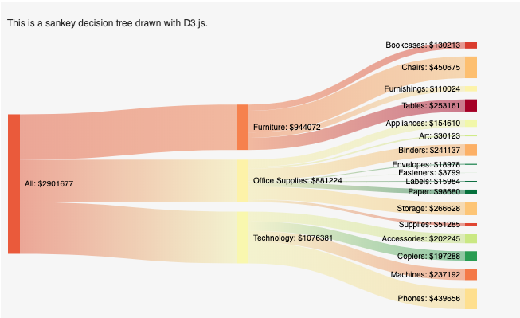

# Tableau Extensions API (vanilla)

This projects shows how to use Tableau Extensions API without using NPM. Here are examples with the SuperStore sample dataset in Tableau.

**Overview Dashboard**


**Products Dashboard**


### Motivation

*Keep it simple.*

> I usually combine vanilla javascript and D3.js for small-scale projects, such that I don't benefit much from using NPM. In my very bare setup, my code changes render instantly. However, if I use NPM, I have to wait about 5 seconds for it to compile each time I want to see my updated code.

> To help others with a similar background (e.g. analysts, non-software engineers) learn Tableau Extensions API, I will examples that don't use tools other than the extensions API itself, D3.js, and HTML/CSS. That way, the barrier to entry is as low as possible from a technical standpoint.

### Recommendations for Starting

See Tableau Extensions API documentation [here](https://tableau.github.io/extensions-api/#), which uses NPM. I recommend understanding the contents in the `manifest.trex` file before using extensions.

### Other References

* [How to read data and apply filters from a Worksheet?](https://tableau.github.io/extensions-api/docs/interfaces/worksheet.html)
* [How to recreate the Tableau UI?](https://tableau.github.io/tableau-ui/docs/index.html)
* [How to encode a base-64 icon for the Manifest file?](https://base64.guru/converter/encode/image/ico)

---

## Add Extension in Tableau

### Add Extension to Dashboard

1. Make sure the `url` in `source-location` in the manifest file has the absolute path to the `index.html` file.
2. Start a local web server (see below).
3. Add `Extension` object to your Tableau dashboard. A pop-up window will appear and ask for the location of the manifest file. 
4. Click on the manifest file. Next, a pop-up window will appear and ask for permissions. 
5. Grant access and the extension should show up.

*Below is the pop-up from step 3.*


### Refreshing Dashboard with Code Changes

1. Click on the dropdown in the extension container.
2. Click **Reload**.

If the `manifest.trex` file is updates, then **Reload** will not work. You will need to re-add the extension or reopen your Tableau workbook.

### Start Local Web Server (Mac)

Run this command in your terminal. This will run a simple local HTTP server on your browser on port 8765.
```
python3 -m http.server 8765
```

---

## Develop with Debugger Enabled

I **highly recommend** using the debugger in Chrome. Before opening a Tableau workbook, you will need to open a debugging port by running a single command in the terminal. Instructions are [here](https://tableau.github.io/extensions-api/docs/trex_debugging.html).

### Enable Debugger (MacOS)

Run this command in your terminal. This opens the Tableau 2020.2 application and enables debugging on port 8696. This does not need to match the HTTP port that you are using to host your extension (the port in the `.trex` file).
```
open /Applications/Tableau\ Desktop\ 2020.2.app --args --remote-debugging-port=8696
```

Then navigate to the URL [localhost:8696](http://localhost:8696). When making changes in your HTML, CSS, or JS files, hit refresh on the browser to reload the extension in Tableau with minimal lag.

---

## Troubleshooting

Here are some reasons why the extentions is not working in Tableau:
* Tableau version must be 2018.2 or higher.
* `Manifest.trex` is not configured correctly. There are some minimum requirements listed on [Tableau's documentation](https://tableau.github.io/extensions-api/docs/trex_manifest.html). One example is using an absolute path within the `<source-location><url>` tags.
* Local HTTP server must be enabled.

If the points above are met, then enable debugging to view the console because there might be an issue with the code.
